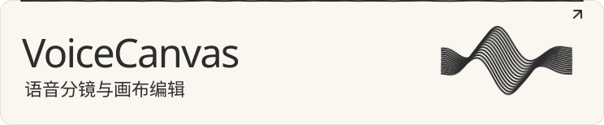
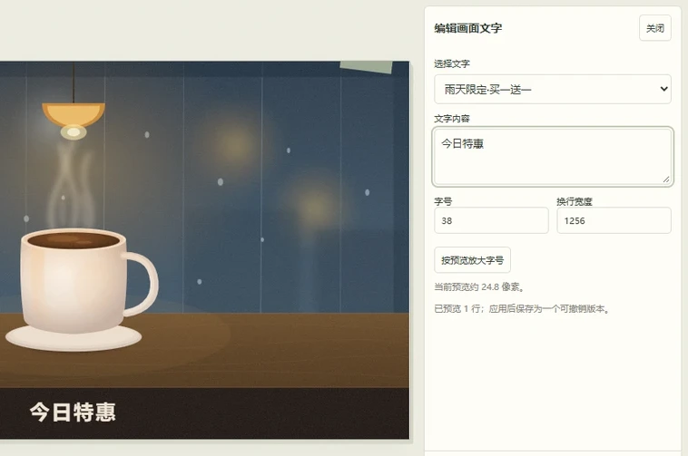

<picture><source media="(max-width: 600px)" srcset="./assets/notes-hero-mobile.svg"></picture>

**于文涛**　AI 应用开发 · Agent 工程化

材料科学与工程硕士在读（2027 届）。切入 AI Agent 工程化的起点，源于读科研文献时一个真实痛点：当大模型给出一个材料合成或性能结论时，我必须知道证据究竟落在原文哪一页、哪一张图注里。

Python · FastAPI · LangGraph · TypeScript · React · PostgreSQL · Docker

## 代表项目

 
 

### Trusted-Memory · Agent 长期记忆安全与治理系统

具备双时间戳冲突消解与写入安全防火墙（PII脱敏与投毒拦截）的 Agent 长期记忆系统。在写入前对 PII 敏感信息与恶意注入进行拦截，基于双时间戳记录 `event_time` 和 `ingest_time` 解决记忆冲突，并引入时间衰减公式实现高可靠的历史溯源与检索。

[项目仓库](https://github.com/jackwentao/Trusted-Memory)

### Agentic-ChemRAG · 面向化学与材料文献的可溯源 RAG 工作台

采用 LangGraph 进行有界多跳编排，实现 PDF 异步解析与图像/图注双通道匹配。基于 PostgreSQL（pgvector）与 BGE-M3 混合检索，提供精确至 PDF 原页的高亮跳转与证据取证。在多栏混排及跨文献多跳对比等高难科研场景下，实现文档 Recall@k 达 **87.5%**，引用页命中率达 **91.7%**。

[项目仓库](https://github.com/jackwentao/Agentic-ChemRAG) · [架构设计](https://github.com/jackwentao/Agentic-ChemRAG/blob/main/docs/ARCHITECTURE.md) · [评测报告](https://github.com/jackwentao/Agentic-ChemRAG/blob/main/docs/reports/profile-retrieval.md)

### VoiceCanvas · 全双工语音驱动的智能生图与分镜画布

采用全双工语音驱动，支持 ASR 语音或文本驱动的连续多镜头分镜生成、SVG 局部编辑、撤销重做与流式语音反馈。通过模块化 Canvas 接口实现前后端协同，提供无麦克风演示模式。

[项目仓库](https://github.com/jackwentao/VoiceCanvas) · [架构设计](https://github.com/jackwentao/VoiceCanvas/blob/main/docs/ARCHITECTURE.md) · [观看演示](https://raw.githubusercontent.com/jackwentao/VoiceCanvas/main/docs/demo/voicecanvas-demo.mp4)

